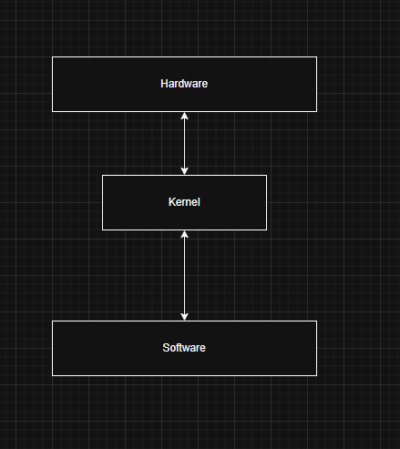

# Day 01 - [Understanding the Linux Architecture - Part 1]

## Objective

What was the goal for today?

The goal of the day is to understand the fundamental architecture behind the Linux operating system.

---
## What I Learned

- What is Linux
- The Linux architecture and its core components
---

## What I Practiced

- To check the current kernel version installed in a particular Linux installation: `uname -r`
- To check the Linux distribution version: `lsb_release -a`

---

## Key Takeaways

- Linux is a free and open-source operating system that is flexible and provides stability and efficient performance compared to other operation systems
- The core piece of the linux operating system is the kernel.
- The kernel is the middleware between hardware and software components of the system. The kernel is the brainbox of the Linux operating system that coordinates activities accorss hardwares and softwares. The kernel is responsible for the following processes:
    - Memory Management 
    - Process Management 
    - Resource allocation
    - Device Management
    - Applicaton interaction
    - Security
- The kernel can be packaged alongside other components to create a distribution. Eg Ubuntu, Debian, Fedora, Kali Linux.

---

## Resources

- [GeeksforGeeks](https://www.geeksforgeeks.org/linux-unix/architecture-of-linux-operating-system/)
- [Article](https://medium.com/@cnwabuisi50/unmasking-the-engine-understanding-the-linux-architecture-part-1-f1ad7d293d70)

---

## Output

High-Level Architectural diagram of the Linux OS
