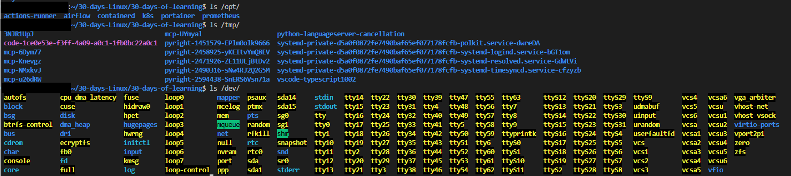

# Day 03 - [Navigating the Linux File System]

## Objective

The goal today is to navigate the file directory in Linux and understand why they exists and what they do.

---

## What I Learned

- Unlike windows, Linux treats everythin as part of one giant tree, starting at the root directory `/`
- A core rule in Linux is that **"Everything is a file."** The hard drive is a file, the keyboard is a file, and even the system memory can be accessed as a file. This design allows the system to use the same simple tools to manage almost any hardware or software resource.

- To keep this "tree" from becoming a mess, Linux follows a strict blueprint called the Filesystem Hierarchy Standard (FHS). This ensures that certain types of files (like configuration settings or user data) are always in the same predictable spot, regardless of which version of Linux you use.

---

## What I Built / Practiced

- used the `ls` and `cat` commands to explore different directory.
- `ls /opt/` showed me the applications installed in the linux server. I could tell that airflow, prometheus, portainer, kubernetes were installed. 

---

## Challenges Faced

- Not all files can be edited due to lack of root user privilages. Further research suggests that it is security best pratices to prevent this from happening.

---

## Key Takeaways

- Because of the FHS standard, these folders are almost always in the same place, whether you use Ubuntu, Fedora, or Kali.
- Permissions Matter: Regular users are mostly locked inside /home. To touch /etc or /var, you need the "Root" master key.
- No matter how many hard drives you plug in, they all appear as branches of the same / tree.

---

## Output

